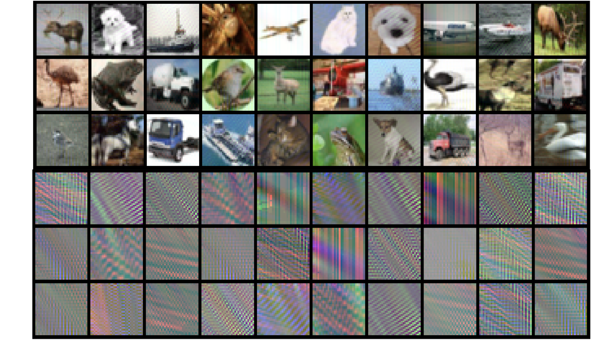

# autoregressive-poisoning
Code for the paper [Autoregressive Perturbations for Data Poisoning](http://arxiv.org/abs/2206.03693) by Pedro Sandoval-Segura, Vasu Singla, Jonas Geiping, Micah Goldblum, Tom Goldstein, David W. Jacobs.

<div align="center">
  
</div>
<div align="center">
  A random batch of 30 images and the corresponding normalized perturbation from our AR CIFAR-10 Poison.
</div>

## Train your own network on our poisons!
We release our AR poisons as Zip files containing PNG images for easy viewing via [Google Drive](https://drive.google.com/drive/folders/1ze0cKAXNcPRkC0TMmObMj-g7Gspp1DpL?usp=sharing). This includes a
- CIFAR-10 AR Poison: ar-cifar-10.zip
- CIFAR-100 AR Poison: ar-cifar-100.zip
- SVHN AR Poison: ar-svhn.zip
- STL AR Poison: ar-stl.zip

After unzipping, these poisons can be loaded using `AdversarialPoison`, a subclass of `torch.utils.data.Dataset`. A model which trains on our AR poisons is unable to generalize to the (clean) test set.

## Setup instructions
1. Create a conda environment with necessary dependencies:
```
conda create --name arp python=3.6
conda activate arp
pip install -r requirements.txt
```
2. Modify paths in [config/base.yaml](https://github.com/psandovalsegura/autoregressive-poisoning/blob/main/config/base.yaml) to point to your choice of dataset and storage. This config is used in [train.py](https://github.com/psandovalsegura/autoregressive-poisoning/blob/main/train.py).

## Generating AR perturbations

See [notebooks/Generate-AR-Perturbations-from-Coefficients.ipynb](https://github.com/psandovalsegura/autoregressive-poisoning/blob/main/notebooks/Generate-AR-Perturbations-from-Coefficients.ipynb) for an example of how to load AR coefficients and generate an AR perturbation of a given size and norm. 

In summary, after loading some AR coefficients, we can call the `generate` function of `ARProcessPerturb3Channel`:
```
# Load coefficients
coefficients = torch.load(os.path.join(repo_dir, 'params-classes-10-mr-10.pt'))

# Use first set of coefficients, for example
ar = ARProcessPerturb3Channel(b=coefficients[0])

# Generate a size (3, 32, 32) perturbation, after cropping a larger (36, 36) perturbation
perturbation, _ = ar.generate(size=(36,36), eps=1.0, crop=4, p=2)
```

The resulting `perturbation` can then be additively applied directly to an image of shape (3,32,32) because the perturbation is of size 1.0 in L2. 

## Finding AR process coefficients

To find a set of 10 AR processes, run:

```
python autoregressive_param_finder.py --total=10 --required_nm_response=10 --gen_norm_upper_bound=50
```

This command will save a file named `params-classes-10-mr-10.pt` using `torch.save`. The format will be identical to that of `RANDOM_3C_AR_PARAMS_RNMR_10` within [autoregressive_params.py](https://github.com/psandovalsegura/autoregressive-poisoning/blob/main/autoregressive_params.py), a list of `torch.tensor`. Additional information can be found in [Appendix A.3](http://arxiv.org/abs/2206.03693).

## Creating a CIFAR-10 poison

Before creating a poison using our script, update `CIFAR_PATH` (and other paths, as required) in [create_ar_poisons_3channel.py](https://github.com/psandovalsegura/autoregressive-poisoning/blob/main/create_ar_poisons_3channel.py) with the location of your CIFAR data. Then, you can create an AR CIFAR-10 poison by calling:

```
python create_ar_poisons_3channel.py ${YOUR_POISON_NAME} --epsilon 1.0 --p_norm 2
```

By default, the code uses params from [autoregressive_params.py](https://github.com/psandovalsegura/autoregressive-poisoning/blob/main/autoregressive_params.py), but you can change this behavior if you like. The script also has support for SVHN, STL, and CIFAR-100.

## Training a model on a poison

We provide a number of models, borrowed from the [pytorch-cifar](https://github.com/kuangliu/pytorch-cifar) repo. To train a ResNet18 on clean CIFAR-10:

```
python train.py misc.project_name=${PROJECT_NAME} misc.run_name=${RUN_NAME} train.batch_size=128 train.augmentations_key="none"
```

To train a model on an AR CIFAR-10 poison:
```
python train.py misc.project_name=${PROJECT_NAME} misc.run_name=${RUN_NAME} train.adversarial_poison_path=${YOUR_POISON_PATH} train.batch_size=128 train.augmentations_key=${AUG}
```
Note that in this command, we specify `train.adversarial_poison_path` to override the config within [config/base.yaml](https://github.com/psandovalsegura/autoregressive-poisoning/blob/main/config/base.yaml), and load a poison. You can set `AUG` to either "none", "cutout", "cutmix" or "mixup". Be sure to update other configs such as `num_workers` as necessary.

This training script uses the `WandbLogger` from [PyTorch Lightning](https://pytorch-lightning.readthedocs.io/en/latest/), so if you use [Weights and Biases](https://wandb.ai/), you can use their online portal to analyze training curves.

### Demo: AR Perfect Model

To demonstrate the simplicity and separability of AR perturbations, we construct a simple CNN which can perfectly classify AR perturbations in [autoregressive_perfect_model.py](https://github.com/psandovalsegura/autoregressive-poisoning/blob/main/autoregressive_perfect_model.py). 

Check out our demo notebook in [notebooks/Demo-of-AR-Perfect-Model.ipynb](https://github.com/psandovalsegura/autoregressive-poisoning/blob/main/notebooks/Demo-of-AR-Perfect-Model.ipynb). The demo notebook demonstrates how we can take some AR coefficients, generate perturbations, and use `PerfectARModel` (initialized with the same AR coefficients) to perfectly classify the novel, generated AR perturbations. `PerfectARModel` is ***not*** trained in any way; it uses manually-specified AR filters (consisting of AR process coefficients) for a single convolution layer. More information can be found in [Appendix A.2](http://arxiv.org/abs/2206.03693) of the paper.

Note that the code for `PerfectARModel` was from an earlier version of our repo where one AR process was responsible for each of the three RGB channels (as opposed to using a different set of coefficients for each of 3 channels). Early in our work, we used terms from convergent series, and manually specified them in `ALL_2x2_AR_PARAMS`. 

### Citation

If you find this work useful for your research, please cite our paper:
```
@article{sandoval2022autoregressive,
  title={Autoregressive Perturbations for Data Poisoning},
  author={Sandoval-Segura, Pedro and Singla, Vasu and Geiping, Jonas and Goldblum, Micah and Goldstein, Tom and Jacobs, David W},
  journal={arXiv preprint arXiv:2206.03693},
  year={2022}
}
```